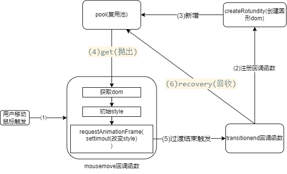

# feel-fish-collection

摸鱼时间随性写的一些特效/工具 集合

# mouse-follow

发布到了油猴脚本：[鼠标跟随特效 (greasyfork.org)](https://greasyfork.org/zh-CN/scripts/466099-%E9%BC%A0%E6%A0%87%E8%B7%9F%E9%9A%8F%E7%89%B9%E6%95%88)

### 结构

pool(复用池)：复用圆形dom节点，调用get，池子有多余的直接返回，池子为空调用createRotundity

createRotundity：调用document.createElement

transitionend事件回调函数：回收dom节点

mousemove回调函数：控制dom节点开始和结束的style样式

### 优化过程

- pool(复用池)
  
  问题：每个圆形都是一个dom节点，随着使用dom节点不断被创建和注册监听，耗费性能
  
  解决：使用复用池子复用dom节点

- 优化dom的结束style样式改变时机

  场景：一般流程是：将dom节点加入dom树，修改dom节点位置触发过渡，transitionend事件回收dom节点

  问题：如果在dom节点被渲染之前就修改dom节点位置，将导致其跳过初始状态，直接进入结束位置状态，没有过渡动画，没有触发transitionend事件回收dom节点。

  解决:

* settimeout回调改变style样式
  
  settimeout是在下一事件循环中执行，但是本轮事件循环中，有可能会跳过渲染阶段，导致dom节点没被渲染，依旧无法解决问题（dom节点回收率：40%）

* requestAnimationFrame回调改变style样式
  
  requestAnimationFrame在下次进行渲染之前调用函数，但是因为时间节点是之前，所以无法完全解决（dom节点回收率：95%）

* requestAnimationFrame中嵌套settimeout
  
  浏览器渲染之前注册下次事件循环的函数
  
  保证在浏览器进行渲染后的下次事件循环中执行。（dom节点回收率：100%）
- 优化dom树
  
  动画开始时使用document.body.appendChild加入dom树
  
  动画结束时使用document.body.removeChild移除dom节点
  
  缺点：频繁改变dom树结构

  优化方案：

  动画开始时dom修改节点 display:block,动画结束时display:none

  修改dom属性，而不是成本更高的dom树结构
